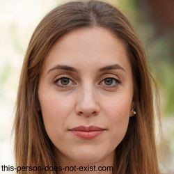

# Persona

| Persona name        | Klaudia Sarnecka                                                                                                                                                                                                                                                                               |
| ------------------- | ---------------------------------------------------------------------------------------------------------------------------------------------------------------------------------------------------------------------------------------------------------------------------------------------- |
| **Persona role**    | Junior Technical Writer                                                                                                                                                                                                                                                                        |
| **Job description** | Klaudia is responsible for creating and maintaining end-user documentation for the company’s software products. She works closely with developers, designers, and localization partners to ensure that documentation is accurate, clear, easy to translate, and suitable for global audiences. |

## Company

<table>
  <tr><td><strong>Company name</strong></td><td>Softline Solutions</td></tr>
  <tr><td><strong>Company size</strong></td><td>50–100 employees</td></tr>
  <tr><td><strong>Industry</strong></td><td>Software Development / IT</td></tr>
</table>

## Demographic information

<table>
  <tr><td><strong>Age</strong></td><td>35</td></tr>
  <tr><td><strong>Gender</strong></td><td>Female</td></tr>
  <tr><td><strong>Education level</strong></td><td>Master’s in Applied Linguistics + Postgraduate Diploma in Technical Communication</td></tr>
  <tr><td><strong>Residential environment</strong></td><td>Urban</td></tr>
</table>

## Personal quote
>*Good documentation should be just as intuitive as the product it supports — even across languages.*

## Biography
Klaudia spent several years as a freelance translator and later worked in an LSP, focusing on software localization. Her exposure to messy source content and inconsistent terminology sparked her interest in the upstream side of the process — writing. She recently transitioned into a technical writing role and is currently exploring tools like MadCap Flare and Lingo to better support her company’s international growth. Her background in localization gives her a unique edge in creating globally ready content from the ground up.

<table>
  <tr><td><strong>Professional goals</storng></td><td><strong>Motivators</strong></td></tr>
  <tr><td><ul><li> Build technical writing expertise with a focus on localization readiness</li>
  <li>Be a localization advocate within her team</li>
  <li>Implement best practices that reduce localization costs and improve quality</li>
  <li>Gain advanced proficiency in Flare and content reuse strategies</li></ul></td><td><ul><li>Solving real problems she's experienced from the translation side</li><li>Building on her language skills in a new technical role</li><li>Gaining new technical skills while using her language background</li><li>Creating documentation that scales across languages</li></ul></td></tr>
  <tr><td><strong>Challenges</strong></td><td><strong>Sources of information</strong></td></tr>
  <tr><td><ul><li>Navigating the learning curve of Flare and topic-based authoring</li><li>Convincing colleagues to adopt localization-friendly practices</li><li>Balancing content clarity for both source and target language users</li></ul></td><td><ul><li>MadCap Software documentation and community forums</li></li>Translation and localization communities</li><li>Technical writing blogs and LinkedIn groups</li>Postgraduate coursework and mentor guidance</li></ul></td></tr>
</table>
